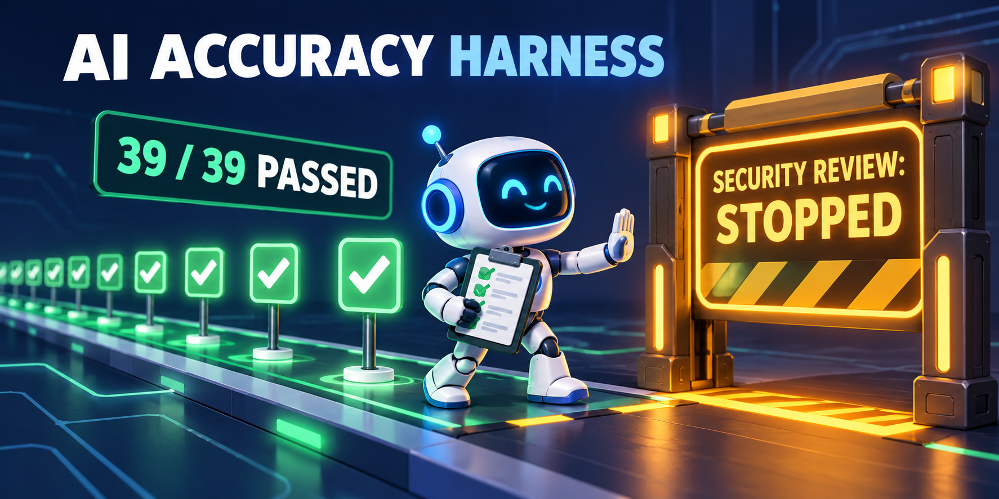
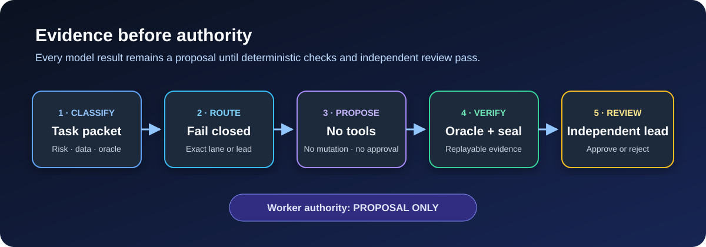
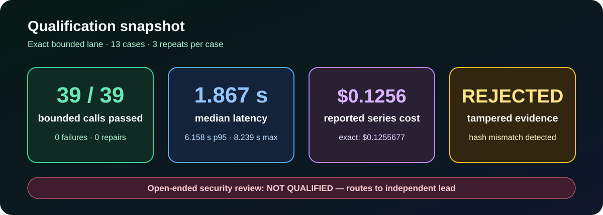

# AI Accuracy Harness

**Make AI workers prove they belong in the lane before trusting their output.**

[](LICENSE)
[](https://www.python.org/)
[](https://github.com/fusiontechstrategies/AI-Accuracy-Harness/actions/workflows/ci.yml)
[](#the-safety-boundary)

AI Accuracy Harness is an evidence-first reference implementation for routing narrowly defined
AI work to qualified local or remote workers. It pins model and provider identity, validates
strict schemas, records complete receipts, seals evidence, and keeps every worker in a
proposal-only role.





## Why this exists

Model output can be fluent, schema-valid, and still wrong. A model should earn access to a
specific task lane by passing repeatable cases with a deterministic oracle. Even then, its
result remains a proposal until independent review and project gates approve it.

This repository demonstrates that operating pattern with two qualified lanes:

| Lane | Intended work | Data boundary | Authority |
|---|---|---|---|
| `LOCAL_DEVSTRAL_V4` | Exact Python test-function extraction | Local only | Proposal only |
| `OPENROUTER_CEREBRAS_GPT_OSS_120B` | Bounded selection among preregistered options | Non-restricted data | Proposal only |
| `LEAD_ONLY` | High-risk, ambiguous, security-sensitive, or externally acting work | Determined by lead | Verification and approval |

Every routing decision explicitly returns `semantic_approval: false`. Worker lanes cannot call
tools, edit repositories, publish artifacts, or approve their own output.

## Qualification results



| Check | Observed result |
|---|---:|
| Bounded structural qualification | **39/39 passed** across 13 cases repeated 3 times |
| Failed or repaired bounded calls | **0** |
| Qualification series reported cost | **$0.1255677** |
| Qualification latency | **1.867 s median**, **6.158 s p95**, **8.239 s max** |
| Packaged live self-test | **Passed in 0.689 s**, reported cost **$0.0007317** |
| Evidence tamper test | Altered proposal **rejected** by hash verification |
| Open-ended security review | **Not qualified** |

These are qualification results for the exact task classes, model identities, provider, profile,
schemas, and cases recorded in this package. They are not a general model benchmark. Read
[Results and interpretation](docs/RESULTS.md) for methodology, limits, and the negative security
result.

## Try the router in 60 seconds

Requirements: Python 3.12 or newer. The router and test suite use only the Python standard
library.

```bash
git clone https://github.com/fusiontechstrategies/AI-Accuracy-Harness.git
cd AI-Accuracy-Harness
python -m unittest discover -s tests -v
python tools/verify_package.py
python select_lane.py examples/remote-bounded-routing-request.json
```

Expected routing decision, formatted for readability:

```json
{
  "admission": "ADMITTED_PROPOSAL_ONLY",
  "lane": "OPENROUTER_CEREBRAS_GPT_OSS_120B",
  "repository_mutation_allowed": false,
  "semantic_approval": false,
  "tools_allowed": false
}
```

No API key or model is needed to test routing. Continue with the
[step-by-step quickstart](docs/QUICKSTART.md) to exercise local, remote, and fail-closed decisions.

## How it works

1. **Classify the task.** Freeze its risk, data sensitivity, required actions, adapter status,
   and deterministic oracle.
2. **Select a lane.** `select_lane.py` admits only the exact qualified combination. Unknown or
   unsafe combinations fall back to `LEAD_ONLY`.
3. **Generate a proposal.** A qualified worker receives a strict task packet and has no tool or
   repository authority.
4. **Validate and seal.** The harness rejects identity drift, fallback, malformed JSON,
   incomplete responses, missing candidates, and altered evidence.
5. **Review independently.** A lead replays the evidence, runs the project oracle, and decides
   whether anything may proceed.

See [Architecture and trust boundaries](docs/ARCHITECTURE.md) for the control flow and threat
model.

## Run the remote proposal worker

The included profile is pinned to `openai/gpt-oss-120b` through Cerebras on OpenRouter. Create a
strict task packet based on `examples/bounded-selection.packet.json`, then run:

```bash
python openrouter_worker.py \
  --profile profiles/openrouter-cerebras-gpt-oss-120b.json \
  --packet examples/bounded-selection.packet.json \
  --output ./evidence-run \
  --key-file /secure/path/openrouter-key.txt
```

On PowerShell, replace each trailing `\` with a backtick or put the command on one line.

The key file must contain one bare key. It is read in memory and is not copied into evidence.
The completed evidence tree is scanned for accidental key disclosure. Use a new output directory
unless resuming a retryable interruption with `--resume`.

The worker records endpoint metadata, exact request and response bytes, validated proposals,
receipts, hashes, and a final evidence seal. Verify a run independently with:

```bash
python verify_evidence.py ./evidence-run
```

## The safety boundary

The harness deliberately refuses broad authority. The following always remain lead-only:

- High or critical risk work
- Open-ended security review and threat adjudication
- Authentication, authorization, cryptography, secrets, and trust roots
- Arbitrary code editing or unrestricted transformations
- Tool calls, deployments, publishing, signing, and other external actions
- Tasks without a qualified adapter and deterministic oracle
- Restricted data without an exact qualified local adapter

Open-ended security auditing was tested and rejected: high-reasoning runs did not complete a
schema-valid answer within the observed completion boundary, while medium-reasoning output
missed known critical defects and included likely false positives. That result is preserved
because a useful harness must record where a model fails.

## Repository map

```text
examples/       Safe routing requests and a bounded task packet
policies/       Frozen lane rules and security probes
profiles/       Exact local and remote worker identities
qualification/ Selected summaries, evidence index, and tamper test
schemas/        Strict JSON contracts
tests/          Unit and adversarial contract tests
tools/          Package manifest builder and integrity verifier
docs/           Quickstart, architecture, results, and graphics
```

## Read next

- [Quickstart](docs/QUICKSTART.md)
- [Architecture and trust boundaries](docs/ARCHITECTURE.md)
- [Results and interpretation](docs/RESULTS.md)
- [Scope and boundaries](SCOPE-AND-BOUNDARIES.md)
- [Adapting the pattern to another project](REUSE-WITH-OTHER-PROJECTS.md)
- [Security policy](SECURITY.md)
- [Contributing](CONTRIBUTING.md)

## License

Copyright 2026 Fusion Technology Strategies.

Licensed under the [Apache License 2.0](LICENSE).

