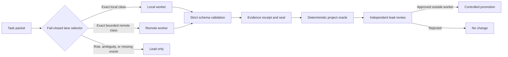

# Architecture and trust boundaries

AI Accuracy Harness separates task admission, proposal generation, deterministic verification,
and approval. No model crosses those boundaries merely because its output looks correct.

## Components

### Lane selector

`select_lane.py` accepts one frozen JSON contract. It rejects unknown keys, unsupported schema
versions, duplicate JSON keys, non-finite numbers, invalid task classes, and invalid risk tiers.
The selection rules place high-risk work, open security analysis, editing, external actions,
unclassified tasks, and tasks without deterministic oracles into `LEAD_ONLY`.

### Proposal worker

`openrouter_worker.py` sends a bounded task packet to an exact model and provider. The request
contains no tool definitions. Provider fallback and provider data collection are denied. A model
or provider mismatch fails the attempt.

### Local validation

Provider-compatible schema translation never replaces local validation. The harness rejects
duplicate keys, non-finite numbers, extra properties, wrong fixed values, incomplete responses,
missing candidates, and workflow-invalid candidates.

### Evidence sealing

Each attempt records the input packet, request, raw response, validated proposal, endpoint
identity, receipt, and hashes. The final seal covers the complete inventory. Resume creates a new
attempt instead of overwriting prior evidence.

### Independent control plane

A project-specific deterministic oracle and an independent lead remain outside the worker. The
worker cannot approve, apply, publish, sign, or deploy its result.

## Trust assumptions

The reference implementation assumes:

- The local Python runtime and filesystem used for verification are trusted.
- The project oracle is independently tested and is strong enough to prove the narrow result.
- Profiles, schemas, policies, and task packets are reviewed before execution.
- Credentials are supplied outside the repository and are scoped appropriately.
- Promotion occurs in a separate controlled workflow after independent review.

## Fail-closed conditions

The worker path stops on identity drift, provider fallback, response truncation, malformed JSON,
schema mismatch, incomplete candidates, evidence mismatch, or a failed project oracle. A stop is
an expected control outcome, not a reason to silently relax the gate.

